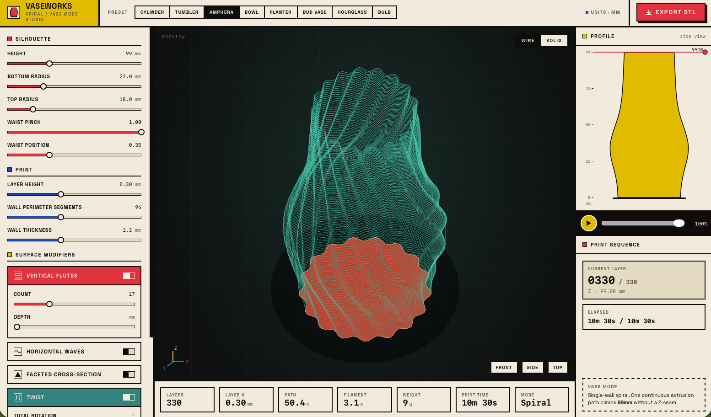

# Vaseworks

A browser-based parametric vase generator for 3D printing in vase mode (single-wall spiralized printing). Adjust silhouette, surface modifiers, and print parameters in real time, then export a watertight binary STL ready for your slicer.



Live: [vaseworks.spencer-russell.com](https://vaseworks.spencer-russell.com)

## Features

- **Presets**: Cylinder, Tumbler, Amphora, Bowl, Planter, Bud Vase, Hourglass, Bulb
- **Real-time 3D preview** with wire and solid views
- **Surface modifiers**: vertical flutes, horizontal waves, faceted cross-section, twist, organic lumps
- **Print sequence visualization** showing how the spiralized path will lay down
- **Binary STL export** optimized for vase-mode slicing — watertight, single-wall, no stray geometry

## Slicing

Drop the exported STL into PrusaSlicer, Bambu Studio, or Cura with vase mode enabled (Settings → Spiralize Outer Contour, or the equivalent option in your slicer) to slice.

## Built with

- React 18
- Vite (JSX, no TypeScript)
- Hand-written geometry math and SVG rendering — no Three.js
- Space Grotesk via Google Fonts
- Static deploy via [Vercel](https://vercel.com)

## Local development

```bash
git clone https://github.com/spencerussell/vaseworks.git
cd vaseworks
npm install
npm run dev
```

Then open [localhost:5173](http://localhost:5173).

To produce the static `dist/` folder for deployment:

```bash
npm run build
npm run preview   # serve the built artifact locally on :4173
```

## About

A project by Spencer Russell / [futureform](https://spencer-russell.com).

## License

MIT — see [LICENSE](LICENSE) file.
